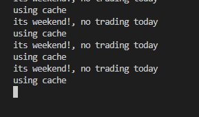
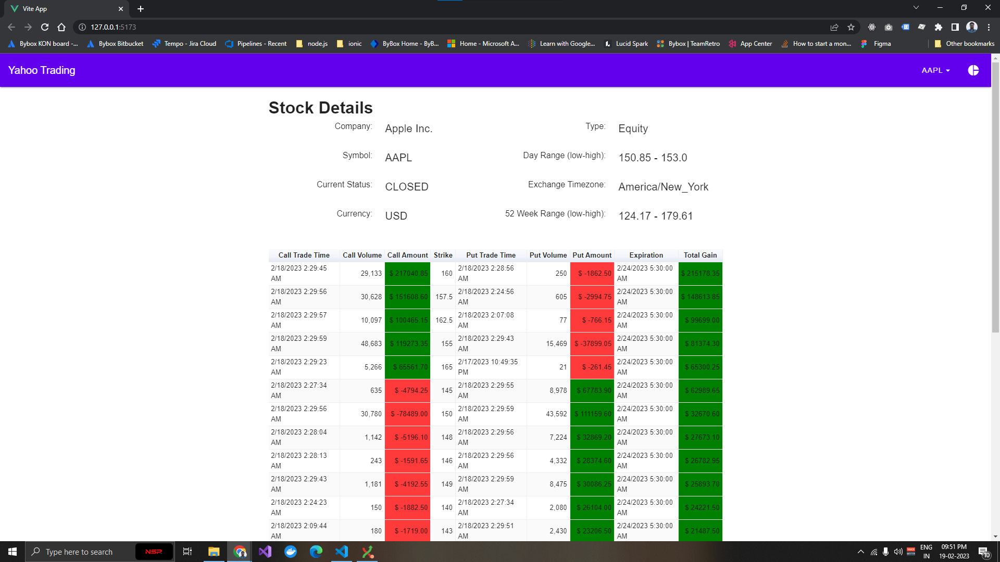
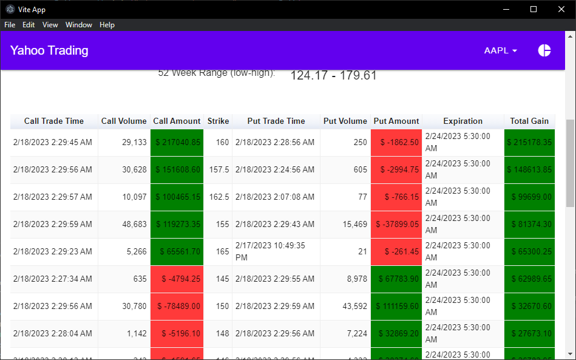

# Yaahoo finance api call demo code with 
This project is a sample for processing the Trading APIs from [Yahoo finance](https://finance.yahoo.com/).
this is the demo from v7 of the api.
it has React sample code for selecting different stocks.
this has demo of only parsing the `Option` trades with `Option Pairs`.
calculates maximum Gain and losses by EOD.
You can analyse the code modules for how different states of the codes are segrigated and re used for getting processed outputs.
also it has O^1 logic for finding the `Option Pairs` using Node ES6 coding practices.

`Server` has a cache included, so after the trading time api will not call the yahoo finance api, because there will be no change in the data. everything will be server by our server cache, including weekends!
but in trading time, server will request the yahoo finance server for real time data provided by the api.

# How to run
this repo has a multiple application included. each application is inside a filder. so you have to cd in to each application and have to run or build as per your need.

## Server
its nodejs Express server.
you can run these for server to be up on PORT 4000 
`cd Node_Server` 
`npm install` 
`npm start` 
screenshot: 

## Web-Frontend
its a Vue.js application, once you run the application it will display the port it is running, (usially: http://127.0.0.1:5173/) 
`cd Vue_frontEnd` 
`npm install` 
`npm run dev` 
 
screenshot: 

## Electron app
its a Electron application. before running this app please install node modules in Vue_frontEnd 
`cd Vue_frontEnd` 
`npm install` 
`cd ../Electron_app` 
`npm install` 
`npm start` 
 
screenshot: 

## Cordova app
its a Cordova application. can built for both android and ios applications. on this demo i have added only android platform.
before running this app please install node modules in Vue_frontEnd 
`cd Vue_frontEnd` 
`npm install` 
`cd ../Cordova_app` 
`npm install` 
`npm start` 
 
screenshot: 

!HAPPY TRADING!